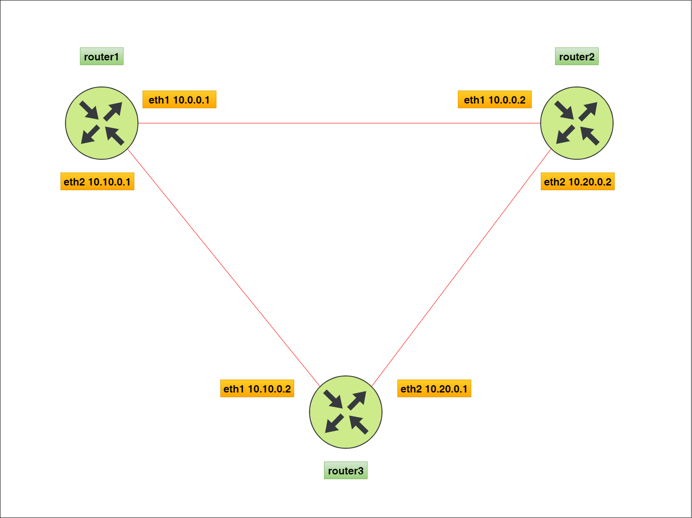

# OSPF

Собираем вот такой стенд:


На сайте написано надо бить VLAN, в методичке и на лекции Павел сказал соединять приватной сетью, так и сделал.

Использовал  FRR, после  запуска виртуалок, необходимо выполнить:
```bash
ansible-playbook -i production/ ospf.yml
```

Проверяем сходимость всех трех роутеров:
```bash
[root@router1 ~]# vtysh

Hello, this is FRRouting (version 7.4).
Copyright 1996-2005 Kunihiro Ishiguro, et al.

router1# sh ip osp nei

Neighbor ID     Pri State           Dead Time Address         Interface                        RXmtL RqstL DBsmL
10.20.0.2         1 Full/DROther      38.905s 10.0.0.2        eth1:10.0.0.1                        0     0     0
10.20.0.1         1 Full/DROther      33.016s 10.10.0.2       eth2:10.10.0.1                       0     0     0
```
```bash
router2# sh ip ospf neighbor 

Neighbor ID     Pri State           Dead Time Address         Interface                        RXmtL RqstL DBsmL
10.10.0.1         1 Full/DROther      39.591s 10.0.0.1        eth1:10.0.0.2                        0     0     0
10.20.0.1         1 Full/DROther      39.438s 10.20.0.1       eth2:10.20.0.2                       0     0     0
```
```bash
router3# sh ip osp nei

Neighbor ID     Pri State           Dead Time Address         Interface                        RXmtL RqstL DBsmL
10.10.0.1         1 Full/DROther      31.961s 10.10.0.1       eth1:10.10.0.2                       0     0     0
10.20.0.2         1 Full/DROther      33.876s 10.20.0.2       eth2:10.20.0.1                       0     0     0
```

Теперь покажем ассиметричность. Для этого включим ** net.ipv4.conf.eth*.rp_filter = 2 **. Теперь мы можем влиять на "вес" маршрута.
Трассирнем 10.20.0.2: 
```bash
                                                                  My traceroute  [v0.92]
router1 (10.0.0.1)                                                                                                                  2020-10-19T11:44:55+0000
Keys:  Help   Display mode   Restart statistics   Order of fields   quit
                                                                                                                    Packets               Pings
 Host                                                                                                             Loss%   Snt   Last   Avg  Best  Wrst StDev
 1. 10.20.0.2                                                                                                      0.0%   326    0.7   0.7   0.5   5.9   0.3
```
Видим, что идет по кротчайшему маршруту. Теперь сделаем "тяжелее" маршрут на **router1** через интерфейс **eth1**:
```bash
[root@router1 ~]# vtysh

Hello, this is FRRouting (version 7.4).
Copyright 1996-2005 Kunihiro Ishiguro, et al.

router1# conf t
router1(config)# int eth1  
router1(config-if)# ip osp cost 1000
router1(config-if)# exit
router1(config)# exit
router1# wr
Note: this version of vtysh never writes vtysh.conf
Building Configuration...
Configuration saved to /etc/frr/zebra.conf
Configuration saved to /etc/frr/ospfd.conf
Configuration saved to /etc/frr/staticd.conf
```
```bash
router1 (10.10.0.1)                                                                                                                                                             2020-10-19T11:50:12+0000
Keys:  Help   Display mode   Restart statistics   Order of fields   quit
                                                                                                                                                                Packets               Pings
 Host                                                                                                                                                         Loss%   Snt   Last   Avg  Best  Wrst StDev
 1. 10.10.0.2                                                                                                                                                  0.0%    15    0.7   0.7   0.6   0.8   0.1
 2. 10.20.0.2                                                                                                                                                  0.0%    14    1.1   1.1   1.0   1.2   0.1
 ```
 Как видим, маршрут поменялся, теперь это не самый короткий, хотя с **router2**, идет по короткому пути до 10.10.0.1

 Чтобы организовать симмитричный маршрут с дополнительным "весом", достаточно на **router2** поднять весь у 10.0.0.2
